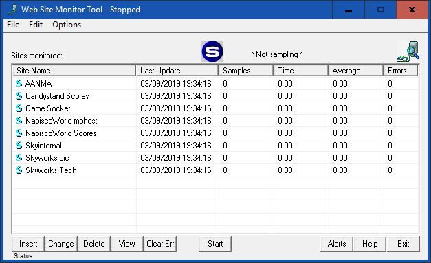

# Site Monitor

Nodejs app to monitor sites and alert if they are not abiding by their normal operating condition.

## Installation

`npm install` will install the dependencies.

`npm start` will run the monitor and the web server.

To stop the service, kill the process or hit the stop URL with the URL-encoded password that you set in the configuration:

```
http://your-site-monitor.com:3399/stop?pass=stopme
```

Note you can change the port number in the configuration.

## Configuration

The sample `configuration-template.json` contains all available configuration options
so I won't go over them all here. It should be self-evident but if not we will update this documentation. Rename/copy
`configuration-template.json` to `configuration.json` and set it up for your requirements.

You should have a database connection. It's not required, but saving samples to a persistent storage
is pretty much a requirement for this app. If you use a database, it must exist. The app will
create the tables if it needs to, but it will not create a database.

Edit `source/configuration.json` with your database connection information and your site definitions.

Set `websiteport` to the port you want to run the web server on (default is 3399). This is for in-bound connections to
view the stats and operation of the site monitor (the site monitor will handle out-bound requests on
ports 80 or 443 according to your configuration.)

## Operation

## Deployment

## License

<svg class="octicon octicon-law mr-1" viewBox="0 0 14 16" version="1.1" width="14" height="16" aria-hidden="true"><path fill-rule="evenodd" d="M7 4c-.83 0-1.5-.67-1.5-1.5S6.17 1 7 1s1.5.67 1.5 1.5S7.83 4 7 4zm7 6c0 1.11-.89 2-2 2h-1c-1.11 0-2-.89-2-2l2-4h-1c-.55 0-1-.45-1-1H8v8c.42 0 1 .45 1 1h1c.42 0 1 .45 1 1H3c0-.55.58-1 1-1h1c0-.55.58-1 1-1h.03L6 5H5c0 .55-.45 1-1 1H3l2 4c0 1.11-.89 2-2 2H2c-1.11 0-2-.89-2-2l2-4H1V5h3c0-.55.45-1 1-1h4c.55 0 1 .45 1 1h3v1h-1l2 4zM2.5 7L1 10h3L2.5 7zM13 10l-1.5-3-1.5 3h3z"></path></svg>[Apache-2.0](https://www.apache.org/licenses/LICENSE-2.0)
        
## Contributing

## About

This is a bit of a labor of love for me. When I worked at Skyworks back around 1999-2000 I needed to monitor
many of the sites we were responsible for. There was nothing available back then and our business relied on
us knowing how well the sites were performing and to alert us when something went wrong. I built the initial
SiteMon project in C++ using MFC and ran it as a Windows app. Samples were stored in an SQL Server database
such that the data could be aggregated from multiple independent computers sampling the sites and providing
redundancy. The last build date was 2002 and the app still runs on Windows 10!



Fast forward to today and that old code and workfrow really doesn't work for where things are at today. I
initially thought I was going to port my original app, but after looking at it for a few minutes realized this
was going to be a rewrite. Node.js really provides the necessary tools to do this rather easily. That's not to
say this is an easy app, but doing it with Node is way better than MFC!
